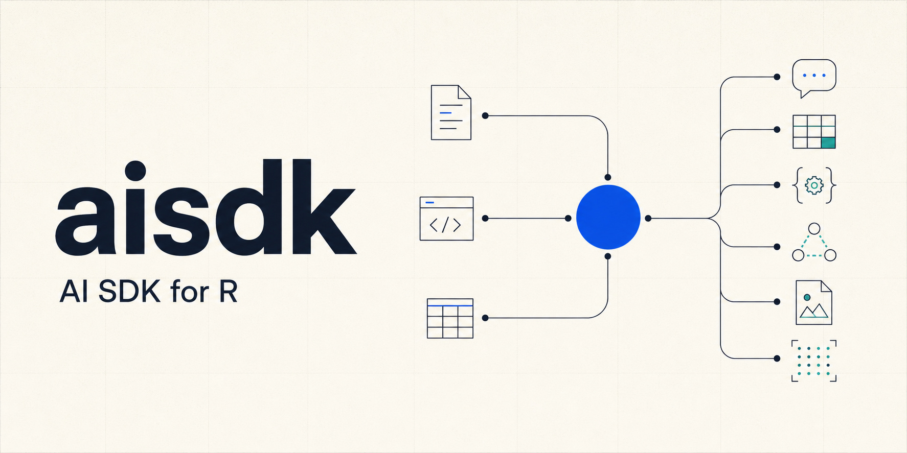

# aisdk: AI SDK for R

<!-- badges: start -->
[](https://lifecycle.r-lib.org/articles/stages.html#experimental)
[](https://CRAN.R-project.org/package=aisdk)
[](https://github.com/YuLab-SMU/aisdk/actions/workflows/R-CMD-check.yaml)
[](https://opensource.org/licenses/MIT)
[](https://deepwiki.com/YuLab-SMU/aisdk)
<!-- badges: end -->



**aisdk** is a provider-neutral runtime for building LLM-powered applications
in R. It gives text, structured output, tools, agents, stateful sessions,
multimodal input, embeddings, and image generation one consistent interface,
while still exposing provider-specific capabilities when they matter.

The package is experimental: the core APIs are usable, but interfaces may
continue to evolve before a stable release.

## What is included

| Area | Main APIs |
|---|---|
| Text and reasoning | `generate_text()`, `stream_text()`, `generate_batch()`, `generate_text_fallback()` |
| Structured output | `generate_object()`, `stream_object()`, `z_object()` and the other `z_*()` schemas |
| Tools and agents | `tool()`, `create_agent()`, built-in R agents, permission hooks, and sandboxed execution |
| Conversations | `ChatSession`, `create_chat_session()`, persistence, model switching, context management, and cost statistics |
| Multimodal input | Provider-neutral `input_text()`, `input_image()`, and `input_file()` blocks for images and documents/PDFs |
| Retrieval and media | `create_embeddings()`, `semantic_search()`, `generate_image()`, `edit_image()`, and `stream_image()` |
| Reliability | Retries with jitter, rate-limit inspection, endpoint failover, transactional session turns, and model fallback |
| Operations and evaluation | Hooks, telemetry, trace sinks, token/cost estimation, caching, and agent evaluation helpers |

Models are addressed as `"provider:model"`, so most application code can
switch providers without changing its control flow.

## Installation

Install the released version from CRAN:

```r
install.packages("aisdk")
```

Install the development version, which may include features documented here
that have not reached CRAN yet, from GitHub:

```r
# install.packages("pak")
pak::pak("YuLab-SMU/aisdk")
```

Alternatively:

```r
# install.packages("remotes")
remotes::install_github("YuLab-SMU/aisdk")
```

## Configure a provider

Core ships with OpenAI, Anthropic, and Gemini providers. Put the key for the
provider you use in a project or user-level `.Renviron` file; do not commit
that file.

```text
OPENAI_API_KEY=...
ANTHROPIC_API_KEY=...
GEMINI_API_KEY=...
```

Restart R after editing `.Renviron`, or run `aisdk::reload_env()` to reload a
project-level file in the current session.

| Provider | Model prefix | Factory | API key variable |
|---|---|---|---|
| OpenAI | `openai:` | `create_openai()` | `OPENAI_API_KEY` |
| Anthropic | `anthropic:` | `create_anthropic()` | `ANTHROPIC_API_KEY` |
| Gemini | `gemini:` | `create_gemini()` | `GEMINI_API_KEY` |

Use `list_models()` to inspect the bundled model metadata and capabilities:

```r
library(aisdk)

list_models("openai")
list_models("anthropic")
list_models("gemini")
```

## Quick start

Set a project-wide default once, then omit `model` from high-level calls:

```r
library(aisdk)

set_model("openai:gpt-5-mini")

result <- generate_text(
  prompt = "Explain tidy evaluation in R in three concise bullets.",
  system = "You are an experienced R package developer."
)

cat(result$text)
result$usage
```

Pass a model ID directly when a call should use a different provider:

```r
result <- generate_text(
  model = "anthropic:claude-sonnet-4-6",
  prompt = "Review this function for edge cases: function(x) mean(x, na.rm = TRUE)"
)
```

The default set by `set_model()` is also used by `stream_text()`,
`ChatSession`, `create_chat_session()`, `auto_fix()`, and the knitr `{ai}`
engine. Use `model()` to inspect it or `model("gemini:gemini-2.5-flash")` to
change it.

### Stream output

```r
stream_text(
  prompt = "Write a short explanation of R environments.",
  callback = function(text, done) {
    if (nzchar(text)) cat(text)
    if (done) cat("\n")
  }
)
```

Front ends can use `on_event` instead of `callback` to receive typed events
such as `thinking_text`, `text_delta`, `intermediate_text`, `final_text`, and
`done`.

## Tools, agents, and sessions

Turn an R function into a model-callable tool. Schemas can be supplied
explicitly or inferred from the function signature.

```r
add_numbers <- tool(
  name = "add_numbers",
  description = "Add two numbers.",
  parameters = z_object(
    a = z_number(description = "First number"),
    b = z_number(description = "Second number")
  ),
  execute = function(a, b) a + b
)

calculator <- create_agent(
  name = "calculator",
  description = "Solves arithmetic problems with tools.",
  system_prompt = "Use the supplied tools for arithmetic.",
  tools = list(add_numbers),
  model = "openai:gpt-5-mini"
)

answer <- calculator$run("What is 1234 + 5678?", max_steps = 4)
cat(answer$text)
```

Agents are stateless workers. Create a `ChatSession` when later turns should
retain conversation history, tools, memory, and usage statistics:

```r
chat <- calculator$create_session(model = "openai:gpt-5-mini")

first <- chat$send("What is 1234 + 5678?")
follow_up <- chat$send("Now divide that result by two.")

chat$stats()
chat$save(file.path(tempdir(), "calculator-session.rds"))
```

Agents can also load progressive-disclosure skills from `SKILL.md` directories
with the `skills` argument. Higher-level `Flow`, `Team`, and `Mission`
orchestration lives in the `aisdk.orchestration` companion package.

## Structured output

Define the expected shape with a schema and let aisdk parse, validate, and
retry malformed responses:

```r
review_schema <- z_object(
  summary = z_string(description = "One-sentence summary"),
  sentiment = z_enum(c("positive", "neutral", "negative")),
  keywords = z_array(z_string(), max_items = 5)
)

review <- generate_object(
  prompt = "Analyze: 'R makes statistical workflows reproducible.'",
  schema = review_schema,
  schema_name = "review",
  mode = "tool"
)

review$object
review$valid
```

`mode = "tool"` uses a forced tool call on models with native tool support.
The default `mode = "json"` works through JSON generation. Use
`stream_object()` to receive best-effort partial objects while JSON is still
arriving.

## Multimodal input

Analyze a local image, URL, or data URI with a vision-capable language model:

```r
plot_review <- analyze_image(
  model = "openai:gpt-5-mini",
  image = "path/to/plot.png",
  prompt = "Describe the main trend and flag any misleading visual choices."
)
```

For documents and PDFs, compose provider-neutral content blocks:

```r
paper_summary <- generate_text(
  model = "gemini:gemini-2.5-flash",
  prompt = list(list(
    role = "user",
    content = list(
      input_text("Summarize the methods and identify the primary endpoint."),
      input_file("path/to/paper.pdf")
    )
  ))
)
```

## Embeddings, retrieval, and images

`semantic_search()` is a compact retrieval primitive for RAG workflows:

```r
documents <- c(
  "R6 provides encapsulated object-oriented programming in R.",
  "testthat is a unit-testing framework for R packages.",
  "Quarto is a publishing system for technical documents."
)

hits <- semantic_search(
  query = "How do I test an R package?",
  documents = documents,
  model = "openai:text-embedding-3-small",
  top_k = 2
)
```

Image generation and editing use a separate image-model interface and write to
`tempdir()` by default:

```r
image <- generate_image(
  model = "openai:gpt-image-2",
  prompt = "A clean editorial illustration of an R console and a data plot",
  output_format = "webp"
)

image$images[[1]]$path
```

## Reliability and cost controls

Use the same APIs in scripts, batch jobs, agents, and user interfaces:

```r
prompt <- "Summarize this report in five bullets."

# Pre-flight token and indicative cost estimate
estimate_prompt_cost(
  model = "openai:gpt-4o-mini",
  prompt = prompt,
  max_output_tokens = 500
)

# Try another provider after a provider, network, timeout, or rate-limit error
result <- generate_text_fallback(
  prompt = prompt,
  models = c(
    "openai:gpt-5-mini",
    "anthropic:claude-sonnet-4-6",
    "gemini:gemini-2.5-flash"
  )
)

# Isolate per-item failures in a concurrent batch
batch <- generate_batch(
  prompts = c("Summarize A", "Summarize B", "Summarize C"),
  model = "openai:gpt-5-mini",
  concurrency = 3
)
```

Completed results expose `usage` and, when pricing is known, `cost_usd`.
`ChatSession$stats()` accumulates both across turns. Built-in prices are
indicative and can be overridden with `set_model_pricing()`. Other operational
controls include `count_tokens()`, `rate_limit_status()`, `create_hooks()`,
`create_permission_hook()`, `set_run_trace_sink()`, Anthropic prompt caching,
and Gemini `gemini_*_cache()` helpers.

## Custom and compatible endpoints

OpenAI Chat Completions, OpenAI Responses, and Anthropic Messages-compatible
endpoints can be added without writing a provider class:

```r
internal <- create_custom_provider(
  provider_name = "internal",
  base_url = Sys.getenv("INTERNAL_AI_BASE_URL"),
  api_key = Sys.getenv("INTERNAL_AI_API_KEY"),
  api_format = "responses",
  supports_native_tools = TRUE,
  responses_state_mode = "stateless"
)

get_default_registry()$register("internal", internal)

result <- generate_text(
  model = "internal:my-model",
  prompt = "Hello from a compatible endpoint."
)
```

For persistent project configuration, declare the provider and default model
in `aisdk.yaml`, while keeping the secret in `.Renviron`:

```yaml
model_providers:
  internal:
    type: custom
    base_url: https://llm.example.org/v1
    wire_api: responses
    api_key_env: INTERNAL_AI_API_KEY
    supports_native_tools: true
    responses_state_mode: stateless

default_model: internal:my-model
```

### Use your Codex or Claude subscription (personal use)

If you already pay for **Codex** (ChatGPT Plus/Pro) or **Claude Code** (Pro/Max),
you can route aisdk through a **locally running OAuth proxy** so requests bill
against that subscription instead of API credits. aisdk never reads, stores, or
refreshes any subscription token and never impersonates an official client — it
only talks to a standard OpenAI/Anthropic-compatible endpoint that the proxy
exposes on localhost. You install and run the proxy yourself.

```r
# Codex — start a proxy first, e.g. `npx openai-oauth`
use_codex_subscription()                 # registers provider "codex"
subscription_proxy_status("codex")       # verify it is up and authenticated
generate_text(model = "codex:gpt-5.4-codex", prompt = "Hello")

# Claude — start a proxy first, e.g. the `claude-auth-proxy` binary
use_claude_subscription()                # registers provider "claude"
generate_text(model = "claude:claude-sonnet-4-6", prompt = "Hello")
```

`detect_subscription_proxies()` probes the common localhost ports and reports
which proxies are running. Override the endpoint with `base_url =` / `port =` or
the `AISDK_CODEX_PROXY_URL` / `AISDK_CLAUDE_PROXY_URL` environment variables.

Because a proxy is just a custom endpoint, you can also declare it in
`aisdk.yaml` without any R code:

```yaml
model_providers:
  codex:
    type: custom
    base_url: http://127.0.0.1:10531/v1
    wire_api: chat_completions
    supports_native_tools: true
  claude:
    type: custom
    base_url: http://127.0.0.1:3000/v1
    wire_api: anthropic
    supports_native_tools: true

default_model: codex:gpt-5.4-codex
```

> **Terms of service — personal use only.** Subscription OAuth is licensed for
> individual, interactive use. Do **not** pool tokens, serve other users, or run
> a hosted/multi-user backend on a subscription. As of **February 2026**,
> Anthropic explicitly prohibits using Claude Free/Pro/Max OAuth tokens in any
> tool other than Claude Code and Claude.ai (including via the Agent SDK) and
> enforces this technically; OpenAI likewise directs automation to API keys.
> These helpers are for your own scripts on your own machine. For anything that
> serves other people, use a Console/Platform **API key** instead.

## Companion packages

The package family keeps the core runtime small and moves optional surfaces to
sibling packages:

| Package | Purpose |
|---|---|
| [`aisdk.providers`](https://github.com/YuLab-SMU/aisdk.providers) | DeepSeek, xAI, Volcengine, NVIDIA, Stepfun, Bailian, OpenRouter, AiHubMix, Moonshot, and Kimi adapters |
| [`aisdk.console`](https://github.com/YuLab-SMU/aisdk.console) | Interactive terminal chat, slash commands, inspector, and tool timeline |
| `aisdk.orchestration` | Higher-level flows, teams, and missions |
| `aisdk.shiny` | Shiny-facing chat and streaming integrations |
| `aisdk.bioc` | Bioconductor semantic adapters and workflow hints |
| `aisdk.bench` | Planning/task benchmarks and frozen benchmark artifacts |

For interactive terminal use:

```r
# remotes::install_github("YuLab-SMU/aisdk.console")
aisdk.console::console_chat("openai:gpt-5-mini")
```

`ask_ai()` collects recent R errors, warnings, traceback, session information,
and editor/workspace context before opening `aisdk.console`. Use
`ask_ai(show_context = TRUE)` to preview the context without launching it.

## Documentation

- [Package website](https://yulab-smu.top/aisdk/)
- [Function reference](https://yulab-smu.top/aisdk/reference/)
- [Release notes](NEWS.md)
- [Issue tracker](https://github.com/YuLab-SMU/aisdk/issues)
