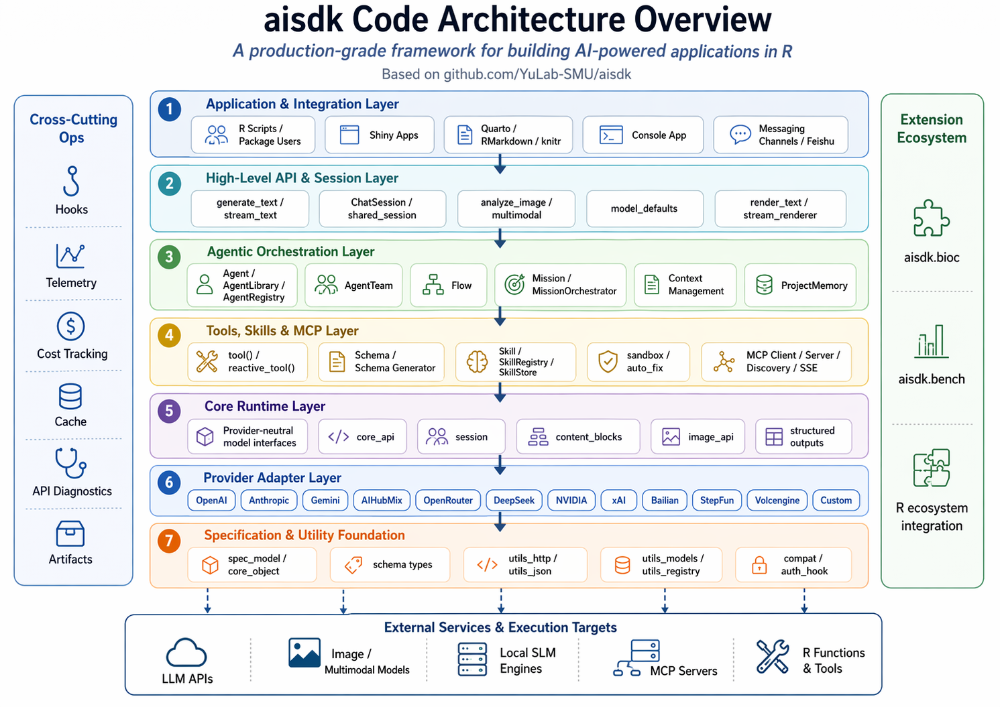

# aisdk: The AI SDK for R

<!-- badges: start -->
[](https://lifecycle.r-lib.org/articles/stages.html#experimental)
[](https://github.com/YuLab-SMU/aisdk/actions/workflows/R-CMD-check.yaml)
[](https://opensource.org/licenses/MIT)
[](https://yulab-smu.top/aisdk/)
[](https://deepwiki.com/YuLab-SMU/aisdk)
<!-- badges: end -->



**aisdk** is a production-grade framework for building AI-powered applications in R. It provides a unified interface for multiple model providers (OpenAI, Anthropic), a powerful agentic system, and seamless integration with the R ecosystem (Shiny, RMarkdown, Quarto).

## Features

-   **Unified API**: Switch between OpenAI, Anthropic, AiHubMix, Gemini and others with a single line of code.
-   **Agentic Framework**: Built-in support for **Agents**, **Tasks**, and **Flows**.
    -   `CoderAgent`: Writes and edits code.
    -   `PlannerAgent`: Breaks down complex problems.
    -   **Multi-Agent Teams**: Coordinate multiple specialized agents
-   **Tool System**: Turn any R function into an AI-callable tool with automatic schema generation.
-   **Structured Outputs**: Generate type-safe JSON, data frames, and complex objects.
-   **Chat Sessions**: Stateful conversation management with history tracking.
-   **Image Generation**: Dedicated image-model APIs with OpenAI `gpt-image-2`, Gemini, Volcengine, xAI, Stepfun, OpenRouter, and AiHubMix support.
-   **Enterprise Ops**: Telemetry, hooks, cost tracking, and MCP (Model Context Protocol) support.

## Installation

You can install the development version of aisdk from [GitHub](https://github.com/) with:

``` r
# install.packages("devtools")
devtools::install_github("YuLab-SMU/aisdk")
```

## Extension Packages

`aisdk` now focuses on the runtime/core package surface. Domain and benchmark
layers are being split into sibling extension packages:

- `aisdk.bioc`: Bioconductor semantic adapters and workflow hints
- `aisdk.bench`: semantic planning/task benchmarks and frozen benchmark artifacts

If you need the old Bioconductor semantic layer or benchmark helpers, install
the corresponding extension package in addition to `aisdk`.

## Quick Start

### Basic Text Generation

``` r
library(aisdk)

file.edit(".env")
## set OPENAI_API_KEY and, if needed, OPENAI_BASE_URL / OPENAI_MODEL in .env.

library(dotenv)
load_dot_env()

# Create a model provider and model
provider <- create_openai()
model <- provider$language_model(Sys.getenv("OPENAI_MODEL"))

# Generate text
response <- stream_text(model, "Explain the concept of 'tidy evaluation' in R.")
render_text(response)
```

### Set a Global Default Model

If you use the same model across a project, set it once and let high-level
helpers reuse it automatically.

``` r
library(aisdk)

# Use a provider:model identifier
set_model("openai:gpt-4o-mini")

# Or store a concrete LanguageModelV1 object
# set_model(create_openai()$language_model("gpt-4o-mini"))

# High-level helpers now work without an explicit model argument
response <- generate_text(prompt = "Summarize the purpose of testthat in R.")
cat(response$text)

chat <- ChatSession$new()
chat$send("Continue with two practical testing tips.")

# Inspect or update the current default
model()
model("anthropic:claude-3-5-sonnet-latest")
```

The package-wide default model is used by `generate_text()`, `stream_text()`,
`ChatSession`, `create_chat_session()`, `auto_fix()`, and the `{ai}` knitr
engine when `model` is omitted.

### Advanced Options (AIHubMix Native Interfaces)

AIHubMix provides compatibility layers that let you use Anthropic and Gemini models with their native API structures, unlocking features like **Claude Prompt Caching** or **Gemini structured outputs**. 
`aisdk` makes this easy with dedicated factory wrappers:

``` r
library(aisdk)

# Use Claude models with the Anthropic REST format (unlocks caching)
aihubmix_claude <- create_aihubmix_anthropic(extended_caching = TRUE)
claude_model <- aihubmix_claude$language_model("claude-3-5-sonnet-20241022")

# Use Gemini models with the Gemini REST format
aihubmix_gemini <- create_aihubmix_gemini()
gemini_model <- aihubmix_gemini$language_model("gemini-2.5-flash")
```

### Custom Providers

If you need to connect to a provider not natively supported by `aisdk`, but which offers an API compatible with OpenAI or Anthropic formats, you can use `create_custom_provider()` to dynamically generate a provider at runtime:

```r
library(aisdk)

# Create a custom provider compatible with OpenAI's chat completions
custom_provider <- create_custom_provider(
  provider_name = "my_custom_proxy",
  base_url = "https://my-custom-proxy.com/v1",
  api_key = Sys.getenv("CUSTOM_API_KEY"),
  api_format = "chat_completions" # Also supports "anthropic_messages" or "responses"
)

# Use it just like any other provider
custom_model <- custom_provider$language_model("my-custom-model-id")
```

### Building an Agent

Create an agent with tools to solve tasks:

``` r
# Define a calculator tool (schema inferred from the function signature)
calc_tool <- tool(
  name = "add_numbers",
  description = "Adds two numbers together",
  execute = function(a, b) a + b
)

# Create an agent
agent <- create_agent(
  name = "Mathematician",
  description = "Solve math problems accurately",
  system_prompt = "You are a helpful mathematician.",
  tools = list(calc_tool)
)

# Run the agent
result <- agent$run("What is 1234 + 5678?", model = model)

# Or stream the response
result <- agent$stream("What is 1234 + 5678?", model = model)

render_text(result)
```

### Stateful Conversations

Agents are stateless by default. To have a multi-turn conversation where the agent remembers previous interactions, create a *Chat Session* from the agent:

``` r
# Create a session from the agent
session <- agent$create_session(model = model)

# First interaction
session$send("What is 1234 + 5678?")

# Follow-up (context is preserved)
session$send("Divide that by 2") 
```

### Interactive Console Chat

If you want a terminal-first workflow, `console_chat()` provides an interactive
REPL on top of `ChatSession` with built-in agent tooling:

```r
# Start with the default terminal agent
# console_chat("openai:gpt-4o")

# Start in compact chat mode without tools
# console_chat("openai:gpt-4o", agent = NULL)
```

Current console features include:

- streaming replies with slash-command session control
- three output modes: `clean`, `inspect`, and `debug`
- a persistent status bar showing model, sandbox, stream, and tool state
- per-turn tool timeline summaries in inspect mode
- an overlay-backed inspector for the latest turn or an individual tool
- read-only inspection of session objects and RStudio `.GlobalEnv` objects
- Seurat-like object summaries for assays, layers/slots, reductions, images,
  metadata columns, and cell/feature scale
- session persistence via `/save` and `/load`

Useful commands:

- `/inspect on`, `/inspect turn`, `/inspect tool <index>`
- `/inspect next`, `/inspect prev`, `/inspect close`
- `/debug [on|off]`, `/stream [on|off]`, `/local [on|off]`
- `/model <id>`, `/history`, `/stats`, `/clear`

Use `/quit` or `/exit` only while the console is waiting for input. During a
running model request, use RStudio Stop/ESC or terminal Ctrl-C to cancel the
current turn; the console restores history to before that request and returns to
the prompt.

For error-driven work, `ask_ai()` collects the recent R error context,
traceback, warnings, active RStudio document when available, session
information, and workspace object summaries, then opens `console_chat()` with
that context as the first turn:

```r
# Run after an R error, or from the RStudio Addin menu
# ask_ai(skill = "biotree")

# Preview what would be sent without launching chat
# ask_ai(show_context = TRUE)
```

### Image Generation

`aisdk` exposes image generation and editing through a dedicated `image_model()` path.

```r
library(aisdk)

provider <- create_openai()
image_model <- provider$image_model("gpt-image-2")

result <- generate_image(
  model = image_model,
  prompt = "A clean editorial photo of a cobalt blue ceramic mug on white linen",
  output_dir = tempdir(),
  background = "transparent",
  output_format = "webp",
  output_compression = 60
)

result$images[[1]]$path
```

OpenAI image editing also supports local masks and, for the latest model family, richer edit controls such as multiple reference images and `input_fidelity`:

```r
result <- edit_image(
  model = create_openai()$image_model("gpt-image-1.5"),
  image = c("inst/extdata/product_front.png", "inst/extdata/product_side.png"),
  prompt = "Combine both references into a single premium product shot.",
  input_fidelity = "high",
  output_format = "webp",
  output_compression = 55,
  output_dir = tempdir()
)
```

### Skills System

The Skills system allows you to package specialized knowledge and tools that can be dynamically loaded by agents. This saves context window space and keeps your agents focused.

**Use the Demo Skill**:

``` r
# Initialize the registry and tools
registry <- create_skill_registry(system.file("skills", package = "aisdk"))
skill_tools <- create_skill_tools(registry)

# Create an agent
analyst <- create_agent(
  name = "DataAnalyst",
  description = "A data analysis agent",
  system_prompt = "You are an expert data analyst. Use the available skills to help the user.",
  tools = skill_tools # <--- Pass the list of tools, NOT the registry
)

# Run the agent
analyst$stream("Load the data_analysis skill and summarize the mtcars dataset.", model = model)
```

**Example Output**:

```
── ❯ Thinking...    
─ 
─  The user wants me to: 
─  1. Load the data_analysis skill 
─  2. Summarize the mtcars dataset 
─   
─  Let me start by loading the skill to see what scripts are available. 
─ 
── ✔ Done thinking (5 lines) 

  (ℹ Hide with options(aisdk.show_thinking = FALSE)) 


I'll help you load the data_analysis skill and summarize the mtcars dataset. Let me start by loading the skill.
ℹ Calling tool load_skill {"skill_name":"data_analysis"}
✔ Tool load_skill returned: "# Instructions Use the `analyze.R` script to analyze datasets.  ## Available Datasets - iris: Fisher's Iris dataset (150 observations, 5
variables) - mtcars: Motor Trend Car Road Tests (32 observat..."── ❯ Thinking...    
─ 
─  Now I can see that the data_analysis skill has an analyze.R script that can analyze datasets. The mtcars dataset is available, and I should use the analyze.R script with the dataset parameter set to "mtcars". I'll use the default top_n value of 5 as shown in the example. 
─ 
── ✔ Done thinking (1 lines) 

  (ℹ Hide with options(aisdk.show_thinking = FALSE)) 


▶ Calling tool execute_skill_script {"skill_name":"data_analysis","script_name":"analyze.R","args":{"dataset":"mtcars","top_n":5}}
✔ Tool execute_skill_script returned: "Dataset: mtcars Dimensions: 32 rows x 11 cols Columns: mpg, cyl, disp, hp, drat, wt, qsec, vs, am, gear, carb Numeric Summary:
mpg: min=10.40, max=33.90, mean=20.09 cyl: min=4.00, max=8.00, mean=..."── ❯ Thinking...    
─ 
─  Great! I've successfully loaded the data_analysis skill and analyzed the mtcars dataset. The output provides a comprehensive summary of the dataset including: 
─   
─  1. Dataset dimensions (32 rows x 11 columns) 
─  2. Column names 
─  3. Numeric summary statistics (min, max, mean) for all variables 
─  4. First 5 rows of the dataset 
─   
─  This gives a good overview of the mtcars dataset, which contains data about Motor Trend car road tests with various performance and design characteristics for 32 different car models. 
─ 
── ✔ Done thinking (8 lines) 

  (ℹ Hide with options(aisdk.show_thinking = FALSE)) 


I've successfully loaded the data_analysis skill and analyzed the mtcars dataset. Here's a summary:


── Dataset Overview ──- Name: mtcars (Motor Trend Car Road Tests)
- Dimensions: 32 observations × 11 variables
- Variables: mpg, cyl, disp, hp, drat, wt, qsec, vs, am, gear, carb

── Key Statistics Summary ──
| Variable | Min   | Max    | Mean   | Description                     |
| -------- | ----- | ------ | ------ | ------------------------------- |
| mpg      | 10.40 | 33.90  | 20.09  | Miles per gallon                |
| cyl      | 4.00  | 8.00   | 6.19   | Number of cylinders             |
| disp     | 71.10 | 472.00 | 230.72 | Displacement (cu.in.)           |
| hp       | 52.00 | 335.00 | 146.69 | Gross horsepower                |
| drat     | 2.76  | 4.93   | 3.60   | Rear axle ratio                 |
| wt       | 1.51  | 5.42   | 3.22   | Weight (1000 lbs)               |
| qsec     | 14.50 | 22.90  | 17.85  | 1/4 mile time                   |
| vs       | 0.00  | 1.00   | 0.44   | Engine type (0=V, 1=Straight)   |
| am       | 0.00  | 1.00   | 0.41   | Transmission (0=Auto, 1=Manual) |
| gear     | 3.00  | 5.00   | 3.69   | Number of forward gears         |
| carb     | 1.00  | 8.00   | 2.81   | Number of carburetors           |

── Sample Data (First 5 Rows) ──The dataset includes classic cars like the Mazda RX4 (21.0 mpg), Datsun 710 (22.8 mpg), and Hornet models, showing a range of performance characteristics from fuel economy to horsepower and weight.

This dataset is commonly used for regression analysis and exploring relationships between car design parameters and fuel efficiency.
```

## Documentation

Full documentation is available at [https://yulab-smu.top/aisdk/](https://yulab-smu.top/aisdk/).
